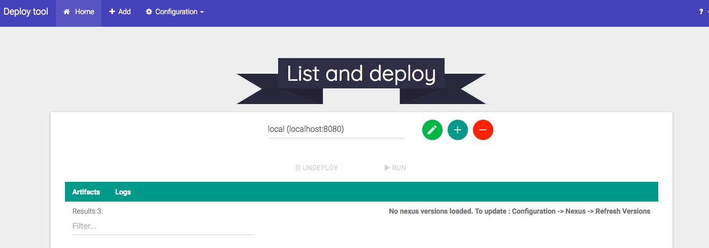

# Tomcat-web-deploy

This project's purpose is to deploy multiple wars at once on a tomcat webserver instance.

# Why ?

This product was designed for deploying .war on Tomcat servers.

Why create  an tool for this ?  

On a mission, my team and me were designated microservices.
The majority of these services were Java web application.
The project had to be continuous delivery for users during the developpement of the main software.

No infrastructure was built for test or dev environnement.
A delivery implies multiples .war files.
The current process used by other team was to download all wars,
connect on the server,
stop the server,
copy on the machine the wars and restart...
This was very painfull for one update and all new developpers
must know all the machines and the procedure to do this.

One first solution was to use jenkins console to deploy.
One of our problematic was that the continous delivery
doesn't fit to the process for the user's test
(falsy bugs when an artifact deployment was in progress).
The use of the manual jenkins console was grueling to go an item page to another.

The creation of this tool was the response of that problematic.

# How ?

# Build and launch the product

``
npm install
``

``
npm start
``

``
npm run run-server
``

# The libraries 

patch : ``npm i -g patch``
